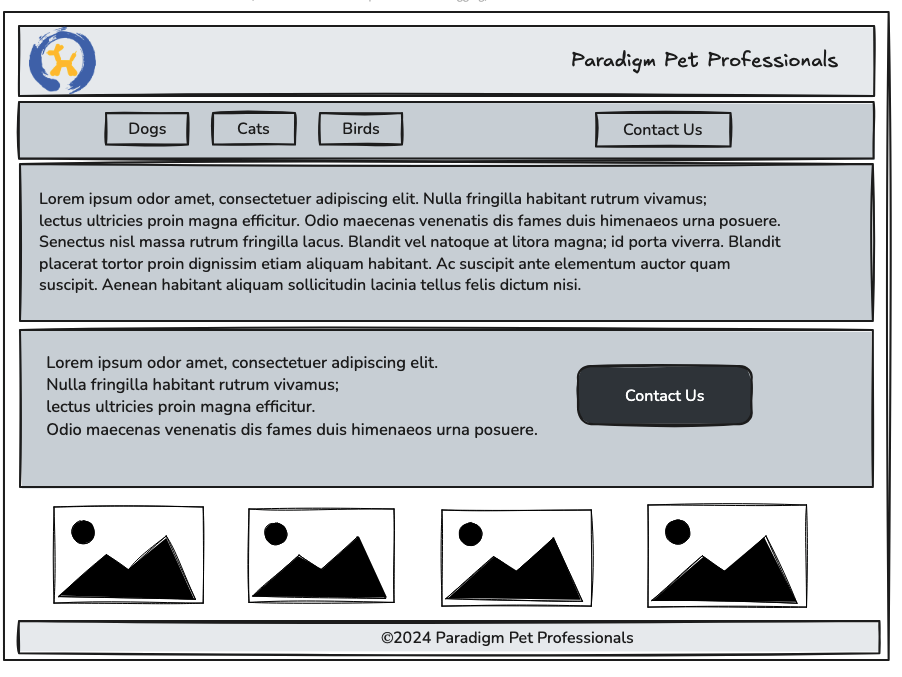

*WGU D279 Assignment - Interactive Prototype*

Created an interactive desktop prototype:

✅ Included each of the redeveloped “Home,” “Dog Owners,” and “Cat Owners” design prototypes, using content for each corresponding persona from “Paradigm Pet Professionals UI Design Specifications.”

✅ Included one new design prototype based on one of the new user personas, including the content provided and the format specified in “Paradigm Pet Professionals UI Design Specifications.”

✅ Include a contact form that users can complete to request a virtual consultation with a pet professional that includes all the required fields specified in “Paradigm Pet Professionals UI Design Specifications.”
 

✅ Included the primary and secondary navigation elements identified in Part I as well as positional awareness techniques that provide the ability to clearly identify where each page is located within the overall information architecture and that allow users to navigate and interact between all sections of the website.
 

✅ Provided a compressed .html file of my interactive desktop prototype, including the following:

•  the updated “Home,” “Dog Owners,” and “Cat Owners” design prototypes

•  the new design "Bird Owners" prototype

•  the virtual consultation form

Low-fidelity wireframe can be seen below:

